# womble
A series of tools/addons/etc for The Campaign Trail mods

## Addon notes
### Banner changer
The [banner changer](./codes/banner_changer.js) is a simple tool for changing the candidate banner logos. It includes a single function, `changeImage()`, which takes an image URL as an argument and updates the banner logo to that image. For example:

```javascript
changeImage("https://i.imgur.com/A1674e8.png");
```

Ideally, it should be used within the `cyoAdventure` function of a mod, but can be used anywhere. Second example:

```javascript
if (e.running_mate_last_name === "Gephardt") {
    changeImage("https://i.imgur.com/BHzPf4K.png");
}
```

### Candidate remover/restorer
[`candidateRemover`](./codes/candidate_remover-restorer.js) is a tool for removing candidates from the election, and optionally restoring them later. It includes both `removeCandidate()` and `restoreCandidate()`. For a quick cheat-sheet:

#### removeCandidate
- `removeCandidate(301);` - removes candidate 301, distributes their votes proportionally among the other candidate
- `removeCandidate(301, { touch: 'both' });` - same as above, but overwrites existing polls (and so shows immediately on the map)
- `removeCandidate(301, { mode: 'toCandidate', target: 300, touch: 'both' });` removes candidate 301, gives their voteshare to candidate 300
- `removeCandidate(301, { mode: 'weights', weights: { 302: 3, 303: 1 }, touch: 'final' });` - removes candidate 301, distributes their voteshare 75% to candidate 302 and 25% to 303, if both are present in-state

#### restoreCandidate
- `restoreCandidate(301, { touch: 'both' });` - restores candidate 301. I missed them
- `restoreCandidate(301, { touch: 'final' });` - restores 301, *but* only makes them appear at the final results

### Change turnout
The [change turnout](./codes/changeturnout.js) function is a simple tool for changing the turnout of a state or the overall turnout of the election. It includes a single function, `changeTurnout()`, which takes a percentage as an argument and updates the turnout to that percentage. For example:
```javascript
changeTurnout(1.15, "CA"); // increases turnout in California by 15%

changeTurnout(0.80, 133); // decreases turnout in South Carolina (pk 133) by 20%

// as shown on TTNW:
if (eminence > 8) {
    changeTurnout(0.60); // nationwide turnout slashed by 40%
} else if (eminence > 6) {
    changeTurnout(0.80); // nationwide turnout slashed by 20%
} else {
    changeTurnout(0.90); // nationwide turnout dips by 10%
}

// here, drops turnout by 30% across the Gulf states
const gulfStates = ["FL", "AL", "MS", "LA", "TX"];

gulfStates.forEach(state => {
    changeTurnout(0.70, state);
});
```

### "Continue" button editor
The [continue button editor](./codes/continue_button_editor.js) is a simple tool for changing the text of the "Continue" button that appears after booting up a mod. You need to replace the text content of the button with your desired text. For example:
```javascript
electionBtn.innerHTML = "Your text here";
```

### "Click here to begin!" button editor
The [click here to begin button editor](./codes/startscreen_button_editor.js) works just like the editor above, but it replaces the "Click here to begin!" button that appears on the title screen of a mod. You need to replace the text content of the button with your desired text. For example:
```javascript
gameStart.innerHTML = "Your text here";
```

### Candidate label editor
The [candidate label editor](./codes/startscreen_label_editor.js) is a tool for changing the labels of candidates at their introduction screens. It lets you define individual labels for candidates and running mates separately, alllowing for those you don't want to be hidden. For example:

```javascript
e.CandLabel1 = "Candidate";
e.CandLabel2 = "Affiliation";
e.CandLabel3 = "Residence";

e.RMLabel1 = "Running Mate";
e.RMLabel2 = "";
e.RMLabel3 = "Leader's Riding";
```

leads to:
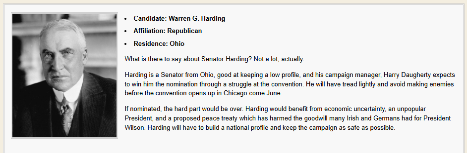 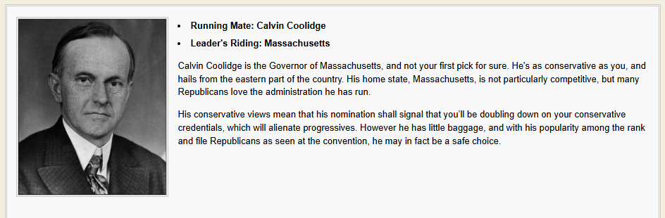

### Election night song
The [election night song](./codes/election_night_song.js) changes the election night song to a custom one. To customize this, you can update the song details in the code below. This snippet should work on music players based off the *W.* and *American Carnage* player codes.
```javascript
const electionPlaylist = new Playlist();
const electionSong = new Song(
  "Mishima/Closing",
  "Kronos Quartet",
  "https://lh3.googleusercontent.com/hZaa-nr_sc1OyI9az-Q4l3dsn_riLbmr4kXSoGNypEv2wmOuOnEQoGDc3mmqrhuU2m1WedR52fVNcEkA=w544-h544-s-l90-rj",
  "https://file.garden/aNtAfG887DiA_7lO/2028AOC/mishimaclosing.m4a"
);
electionPlaylist.addSong(electionSong);
changePlaylist(electionPlaylist);
```

### Polling blackout
The [polling blackout](./codes/polling_blackout.js) disables the map view from a specific question onwards, similar to a Polling Blackout feature used in mods like *Y. of Korea*. (The version used here is an observer-less version made for *2028: An Old Cycle*.) To customize this, you can update the question number in the code by updating to the question number you want the blackout to start from.
```javascript
function isBlackoutPeriod() {
  return e.question_number > 22; // blackout will start after answering question 23
}
```

You can also change the text of the blackout message, or the hover text of the map view button, by editing below:
```javascript
mapButton.innerHTML = "Polling Blackout Period";
mapButton.title = "It's all so hazy.";
```

### Temporary song easter egg
In *All The Way*, clicking candidate/running mate images a total of six (6) times unlocks a new song in the music player. This is the [temporary song easter egg](./codes/song_easteregg.js) feature; here, we have a cleaned up version that lets it work in the players shown here. To customize it, you need to replace the image link that will trigger the songs, and also the song data you want, as shown here:
```javascript
  "https://i.imgur.com/kyGgGv1.gif": new Song(
    "68 Nixon",
    "The Chad Mitchell Trio",
    "https://i.imgur.com/qCeXoEF.png",
    "https://audio.jukehost.co.uk/GbUjVZl2OLsFKuDCDtXqtRYyx1SVm3Sy"
  ),
``` 

See example:
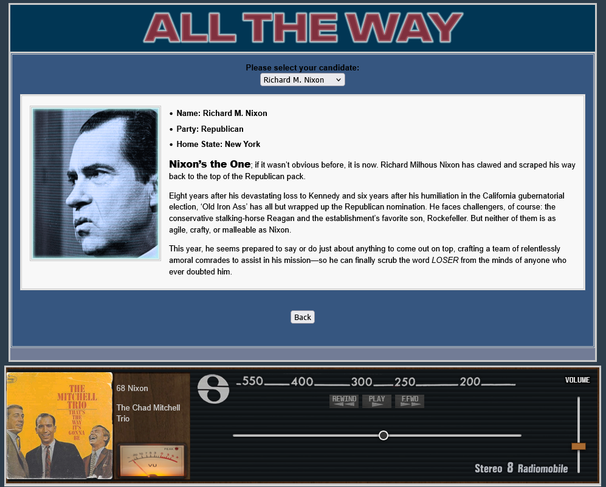

### Volatility feature
The [volatility applier](./codes/volatility_applier.js) snippet, as seen in *1992: Moonbeam*, applies volatility to global multipliers in the answer score global JSON. In other words, it randomly adjusts the values of global multipliers to introduce volatility into the scoring process, increasing the unpredictability of your answers.

For an individual answer, you can set a manual volatility value by creating a `volatility_range` property in your desired answer score. For example:

```json
{
        "model": "campaign_trail.answer_score_global",
        "pk": 15000,
        "fields": {
            "answer": 2000,
            "candidate": 78,
            "affected_candidate": 77,
            "global_multiplier": 0.005,
            "volatility_range": [0.0005, 0.0009]
        }
    },
```

will set a volatility range of 0.0005 to 0.0009 for that answer, meaning the global multipliers will be randomly adjusted within that range.

----

## Music players
### All The Way player
The radio-themed player shown in the mod *1968: All The Way*. Shown here is a modified version of the player with some optimizations/cleanups and a more readable progress bar. See source [here](./players/atw_player.js).
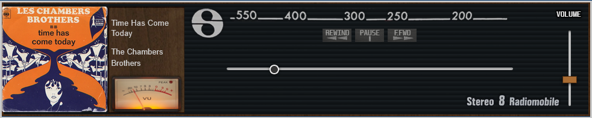

### American Carnage player
The Spotify-themed music player shown in the mod *American Carnage*. Shown here is a modified version of the player initially made for *2028: An Old Cycle*. See source [here](./players/ac_player.js).
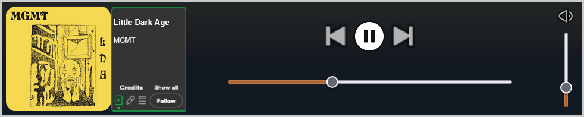

### An Old Cycle player
Also a Spotify-themed music player, this was made for *2028: An Old Cycle*. See source [here](./players/aoc_player.js).
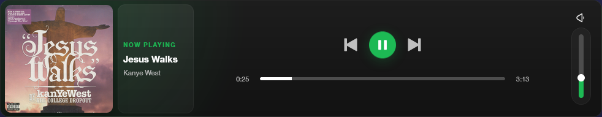

### More Than Ever player
The tape recorder-like music player shown in *1972: More Than Ever*, and also in *1976: Year Zero*. Shown here is a modified version of the player with some optizations. See source [here](./players/mte_player.js).
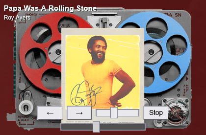

### No More Maga player
This is a modified version of the music player used in the mod *2024: No More Maga*. Shown here is a modified version of the player with a lower initial volume and other minor optimizations. See source [here](./players/nmmaga_player.js).
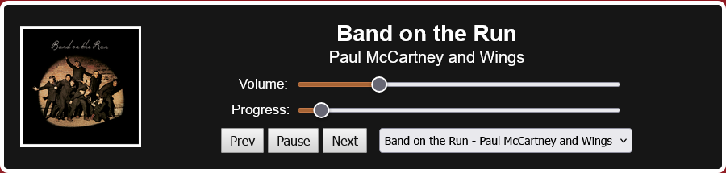

### QuickTime player
Based off the QuickTime player, this was initially made for *2019 DOTP*, meant to be a remake of the *2019 North Korea* scenario. See source [here](./players/quicktime_player.js).
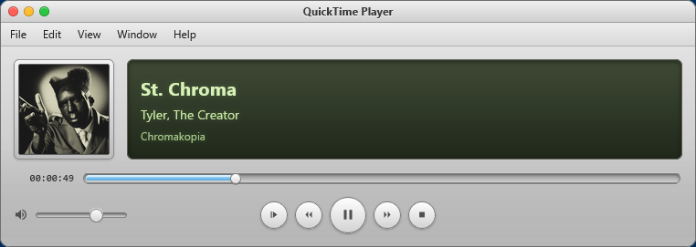

### Quinto player
This was made for the unreleased Dan Quayle presidency simulator *Quaylee*, on top of the underlying code for the player used for *Moonbeam*. See source [here](./players/quinto_player.js).
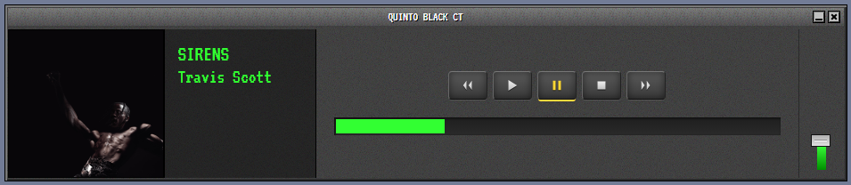

### ROC player
This is a modified version of the player used in *2000 ROC Redux* and other mods in the ROC series, with some optimizations and positioning fixes so it aligns with other players' layouts. See source [here](./players/roc_player.js).
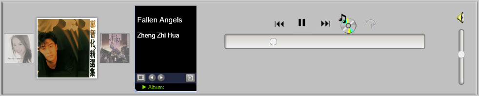

### W. player
The Windows Music Player-esque music player shown in the mods *W.* and *2004: Four More Wars*. Shown here is a modified version of the player with its Windows XP progress bar and volume control themes included, and also the ability to click on the progress bar to seek. See source [here](./players/w_player.js).
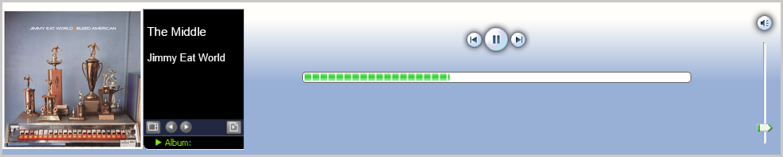

----

# Mod notes
Mods listed here are in various stages of development, and may be incomplete or buggy. Some may be intended for private use, but are being shared here for the sake of open-source-ness and preservation. Finally, a few others were canceled before they were finished, but are being shared here for the sake of "what could have been", or are here after being removed from the CTS mod gallery.

I do not own the content in these mods (unless otherwise specified), and am not responsible for any of it. All credit goes to the original creators. If you are the creator or responsible for any of the content in these mods and would like it removed, please contact me so I can take it down.

See [the mods folder](./mods) for the full list of mods.

## Our Revolution
This is a patched version with some extra fixes for the mod, including some optimizations, other UI changes and a revamped Game Stats design. Codes can be found [here](./mods/2024%20-%20Our%20Revolution_init.txt) (Code 1) and [here](./mods/2024%20-%20Our%20Revolution_SandersHarris.txt) (Code 2). See example:
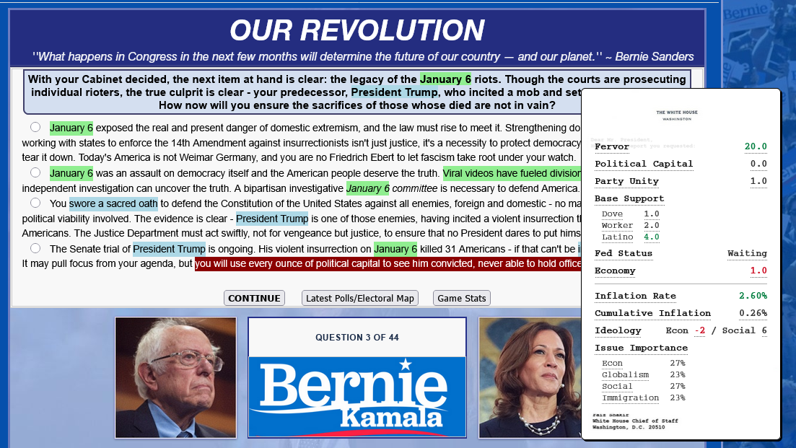

Also included, within the others folder, here are:
- DeanDemocracy '68: a mod where James Dean, alive and well, runs for president in 1968. He faces off against the real-life candidates of that year, as well as a few other ones. Available running mates for Dean include Montgomery Clift, Robert Kennedy, Richard Daley, and Frank Sinatra. Running mates for Nixon are Spiro Agnew, Ronald Reagan, John Lindsay, and George Bush. Finally, George Wallace's running mates are Curtis LeMay, Ezra Taft Benson, and John Wayne. I might get back to this eventually now that I have the codes, but much of our progress on the question has been lost.
- 1804: Assassin's Creed: made by mefoo, never added to the loaders.
- 2012 Razistorija: made by the group [Memorandum Teleoptik](https://memorandumteleoptik.org/) and is centered around the 2012 presidential election in Yugoslavia, in an alternate timeline where the country was not dissolved in the 1990s. This is a patched version that includes a few bug/achievement fixes and quality of life improvements (especially to the political compass within the mod), but is otherwise the same as the original release.
- 2028: Smoke In The Air: J.D. Vance vs. "an 18-year-old genderfluid Deltarune fan [that] somehow got the nomination and convinced some random dude they shitposted with 3 years ago to join the ticket."
- 2028: Soul of the Nation: a Harris 2028 mod made by Mari. A Trump side was made but seemingly never released, though the Harris side is complete and available here. Minor CYOA patches have been included here, but the mod is otherwise the same as the last-available version.
- 2028: The American Crossroads: also known as 2028 Redux. Made by gamerdoglover, this is a Gavin Newsom vs J.D. Vance mod. It was withdrawn fom the CTS mod loader for bug fixes, though it was not re-uploaded. This is a patched version that includes a fix to have the scenario map actually show up on the screen.

----

## Nina's CYOA guide
This is a guide for making CYOA questions, made by Nina. It includes tips and tricks for making good CYOA questions, as well as some common pitfalls to avoid. A copy of it is kept here for preservation as the original site it was hosted has since gone down. See [the guide here](./codes/cyoa/index.html).