# womble
A series of tools/addons/etc for The Campaign Trail mods.

(Any suggestions or bug reports? Send us a note [here](https://github.com/StrawberryMaster/womble/issues/new/choose)!)

## Addon notes
### Apply effects to all candidates
By default, effects in the answer global/state JSON only apply if the candidate specified in the `candidate` field *is also* the player candidate. [This snippet](./codes/apply_all_effects.js) removes that filter, allowing effects to apply to all candidates regardless of which one the player is. No other changes are needed, and it should work on any mod without any extra setup. This is *experimental* and may cause unintended consequences, so make sure to test it out before using it in a mod!

### Answer swapper
The [answer swapper](./codes/answer_swapper.js) is the bread and butter for swapping answer behaviors. It exchanges which question two answers belong to, and optionally swaps their effects too. Think of it like redirecting traffic: if answer A was supposed to go to question 1, and answer B to question 2, this flips that around. The `takeEffects` parameter controls whether all the associated scoring/feedback also gets swapped.

Example:
```javascript
// swap answer PKs 8325 and 8549, along with their effects
answerSwapper(8325, 8549, true);

// if applesauce is greater than 2, AND
// you're on question 4, then swap answer 8325 with 8549
if (e.question_number === 5 && applesauce > 2) {
    answerSwapper(8325, 8549, true);
}

// swap answer PKs 8325 and 8549, but keep their effects the same
answerSwapper(8325, 8549, false);
```

### Anti-cheat system
The [anti-cheat system](./codes/anti_cheat.js), originally made for TCT.net, is a simple tool for disabling console cheats, the benefit checker, cheat menus, and autoplay. You are able to configure which features to disable or enable, by setting the corresponding fields in the `disableConfig` object to `true` or `false`.

By default, all features are disabled. The example below disables all features except autoplay.
```javascript
const disableConfig = {
  console: false,
  benefit: false,
  cheatMenu: false,
  autoplay: true
};
```

### Banner changer
The [banner changer](./codes/banner_changer.js) is a simple tool for changing the candidate banner logos. It includes a single function, `changeImage()`, which takes an image URL as an argument and updates the banner logo to that image. For example:

```javascript
changeImage("https://i.imgur.com/A1674e8.png");
```

Ideally, it should be used within the `cyoAdventure` function of a mod, but can be used anywhere. Second example:

```javascript
if (e.running_mate_last_name === "Gephardt") {
    changeImage("https://i.imgur.com/BHzPf4K.png");
}
```

### Candidate remover/restorer
[`candidateRemover`](./codes/candidate_remover-restorer.js) is a tool for removing candidates from the election, and optionally restoring them later, as first shown in *2012: Obamanation*, where it is possible for Joe Lieberman to withdraw in favor of Clint Eastwood, with Eastwood taking over his support. It includes both `removeCandidate()` and `restoreCandidate()`. For a quick cheat-sheet:

#### removeCandidate
- `removeCandidate(301);` - removes candidate 301, distributes their votes proportionally among the other candidate
- `removeCandidate(301, { touch: 'both' });` - same as above, but overwrites existing polls (and so shows immediately on the map)
- `removeCandidate(301, { mode: 'toCandidate', target: 300, touch: 'both' });` removes candidate 301, gives their voteshare to candidate 300
- `removeCandidate(301, { mode: 'weights', weights: { 302: 3, 303: 1 }, touch: 'final' });` - removes candidate 301, distributes their voteshare 75% to candidate 302 and 25% to 303, if both are present in-state

#### restoreCandidate
- `restoreCandidate(301, { touch: 'both' });` - restores candidate 301. I missed them
- `restoreCandidate(301, { touch: 'final' });` - restores 301, *but* only makes them appear at the final results

### Candidate renamer
[`candidateRenamer`](./codes/candidate_renamer.js) is a tool for renaming candidates on the election map and results pages. It includes a single function, `getTargetName()`, which returns the correct name for a given state abbreviation. Although it works automatically, you can also use it to override the default name for a given state. In the example below, a candidate globally named "Ted Kennedy" is referred to, in the final results table, as "Edward Kennedy" in Massachusetts and Oregon, but as "Teddy Kennedy" elsewhere.

You may need to replace all instances of "Ted Kennedy" with the name your character uses and "Teddy Kennedy" with the name you want.

### Change turnout
The [change turnout](./codes/changeturnout.js) function is a simple tool for changing the turnout of a state or the overall turnout of the election. It includes a single function, `changeTurnout()`, which takes a percentage as an argument and updates the turnout to that percentage. For example:
```javascript
changeTurnout(1.15, "CA"); // increases turnout in California by 15%

changeTurnout(0.80, 133); // decreases turnout in South Carolina (pk 133) by 20%

// as shown on TTNW:
if (eminence > 8) {
    changeTurnout(0.60); // nationwide turnout slashed by 40%
} else if (eminence > 6) {
    changeTurnout(0.80); // nationwide turnout slashed by 20%
} else {
    changeTurnout(0.90); // nationwide turnout dips by 10%
}

// here, drops turnout by 30% across the Gulf states
const gulfStates = ["FL", "AL", "MS", "LA", "TX"];

gulfStates.forEach(state => {
    changeTurnout(0.70, state);
});
```

### "Continue" button editor
The [continue button editor](./codes/continue_button_editor.js) is a simple tool for changing the text of the "Continue" button that appears after booting up a mod. You need to replace the text content of the button with your desired text. For example:
```javascript
electionBtn.innerHTML = "Your text here";
```

### "Click here to begin!" button editor
The [click here to begin button editor](./codes/startscreen_button_editor.js) works just like the editor above, but it replaces the "Click here to begin!" button that appears on the title screen of a mod. You need to replace the text content of the button with your desired text. For example:
```javascript
gameStart.innerHTML = "Your text here";
```

### Candidate label editor
The [candidate label editor](./codes/startscreen_label_editor.js) is a tool for changing the labels of candidates at their introduction screens. It lets you define individual labels for candidates and running mates separately, alllowing for those you don't want to be hidden. For example:

```javascript
e.CandLabel1 = "Candidate";
e.CandLabel2 = "Affiliation";
e.CandLabel3 = "Residence";

e.RMLabel1 = "Running Mate";
e.RMLabel2 = "";
e.RMLabel3 = "Leader's Riding";
```

leads to:
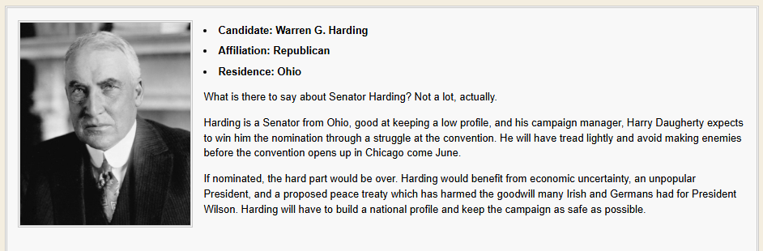 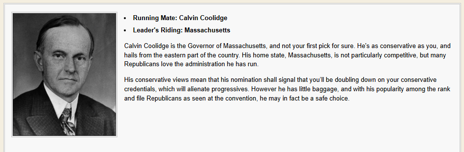

### County map viewer
This [county map viewer](./codes/county_map_viewer.js), first seen in *The Major Leagues*, allows you to view county-level election results on a map. It is fairly accurate compared to the game results, and allows you to see margins, vote totals, shifts, and even redraw the states for your own liking!

For best usage, change the values of `CURRENT_YEAR` and `HISTORICAL_YEAR` in the code to match the election of your choice *and* the previous election you want to compare it to. For example, if you want to compare the 2020 election to the 2016 election, set `CURRENT_YEAR` to `2020` and `HISTORICAL_YEAR` to `2016`.

Note that, as of now, the county map viewer works best with election results from 1900 onwards, although results all the way back to 1824 are available. (The Precincts tab supports election results from 2008 onwards, while the Districts tab includes districts from the 63rd Congress (1912) onwards.)

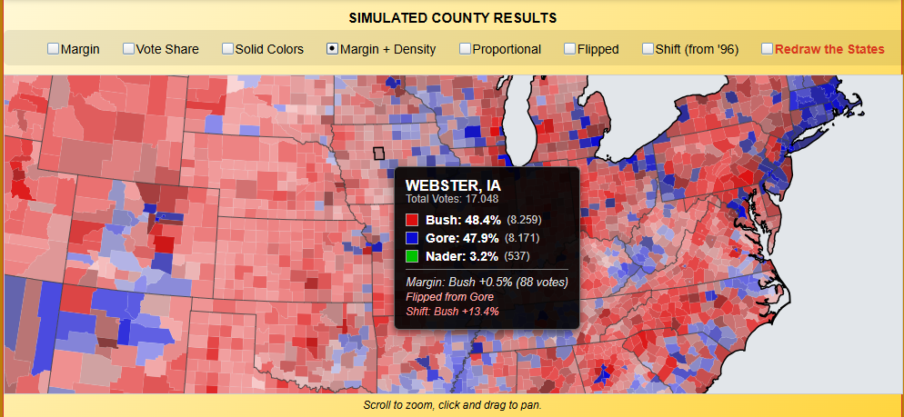

### Data visualizer
This [data visualizer](./codes/data_visualizer.js), first seen in *Little Big Man*, is a tool that enhances the existing post-election night visualization experience by including a tab with several map viewing options, letting you see margins, state stances, candidate stances, and see how much a swing, combination, or head-to-head battle between candidates could've changed the outcome.

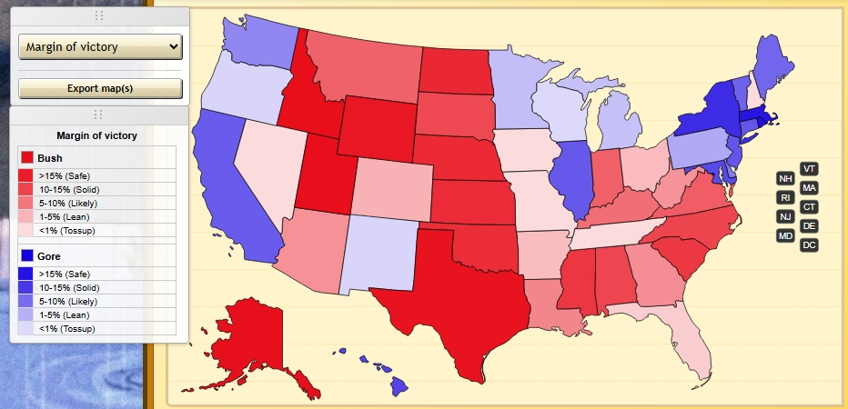

### Dynamic election night
This [dynamic election night](./codes/dynamic_election_night.js) feature, first shown in *Little Big Man* is a tool that enhances the existing election night experience by displaying different margins for states until they are called, allowing for a more dynamic and engaging election night. It also includes a special clock to show the time the state gets called, and the ability to see the ongoing vote count.

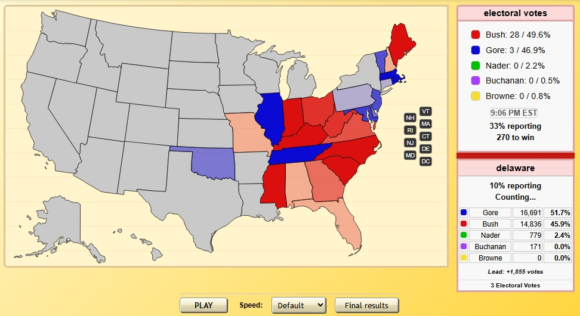

### Election night song
The [election night song](./codes/election_night_song.js) changes the election night song to a custom one. To customize this, you can update the song details in the code below. This snippet should work on music players based off the *W.* and *American Carnage* player codes.
```javascript
const electionPlaylist = new Playlist();
const electionSong = new Song(
  "Mishima/Closing",
  "Kronos Quartet",
  "https://lh3.googleusercontent.com/hZaa-nr_sc1OyI9az-Q4l3dsn_riLbmr4kXSoGNypEv2wmOuOnEQoGDc3mmqrhuU2m1WedR52fVNcEkA=w544-h544-s-l90-rj",
  "https://file.garden/aNtAfG887DiA_7lO/2028AOC/mishimaclosing.m4a"
);
electionPlaylist.addSong(electionSong);
changePlaylist(electionPlaylist);
```

### Feedback updater
The [feedback updater](./codes/feedback_updater.js) is a tool for changing the feedback text that appears after answering a question. It includes a single function, `updateFeedback()`, which takes a string as an argument and updates the feedback text to that string. Note it supports both answer PKs and feedback PKs. For example:
```javascript

// update feedback for answer PK 8325
updateFeedback(8325, "Your custom feedback text here");

// update feedback for feedback PK 5000
updateFeedback(5000, "Your custom feedback text here");

// if player selects answer 2500 or 2501, update feedback
if ([2500, 2501].includes(ans)) {
    updateFeedback(3952, "This is not the feedback you think it is.");
}
```

### Multiplayer feature
The [multiplayer](./codes/multiplayer.js) feature allows for multiplayer functionality in Campaign Trail Showcase. Based on the original code from [The New Campaign Trail MP](https://github.com/Mrcinemazo9nn/The-New-Campaign-Trail-MP) by [Mrcinemazo9nn](https://github.com/Mrcinemazo9nn), with modifications made for *Campaign Trail Showcase*.

Unlike the original code, this version is built on WebRTC (Web Real-Time Communication), which allows two browsers to communicate directly with each other without requiring a dedicated game server. Before a WebRTC connection can be established, the browsers must exchange connection information through a process known as signaling. Normally, this is handled by a signaling server. Here though, we use [ntfy.sh](https://ntfy.sh), a free public publish/subscribe service, to facilitate the exchange of connection metadata. The host publishes its connection data to a unique topic (`tct-p2p-[RoomCode]`), while the guest subscribes to that topic using Server-Sent Events (SSE). Once the WebRTC handshake is complete and the peer connection is established, the ntfy.sh signaling channel is closed and all further communication occurs exclusively through a private `RTCDataChannel` (`tct_multiplayer`).

Notably, it works on both the mods on that site and also on custom/local mods saved by the user (as long as the other user also has the local mod installed). Note that not all mods are compatible with multiplayer, particularly mods with only one side.

**How to use**: both the host and player need to paste the multiplayer code into their browser console. (It can be opened using Ctrl + Shift + J on Windows/Linux or Cmd + Option + J on Mac.) After pasting the code, you should click on the "Play Online" button that appears on the title screen of the mod. This will open a prompt where you can either create a room as the host or join an existing room as a guest.

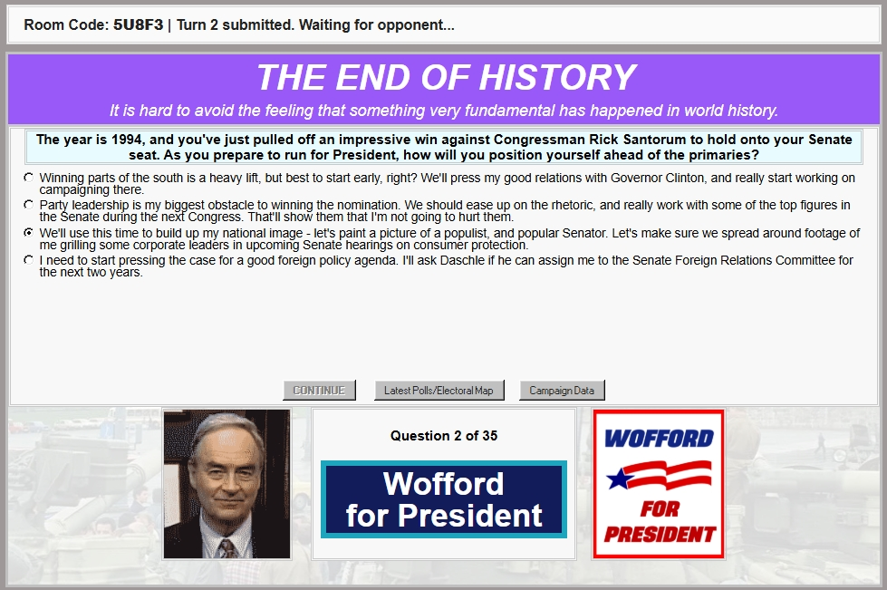

### Polling blackout
The [polling blackout](./codes/polling_blackout.js) disables the map view from a specific question onwards, similar to a Polling Blackout feature used in mods like *Y. of Korea*. (The version used here is an observer-less version made for *2028: An Old Cycle*.) To customize this, you can update the question number in the code by updating to the question number you want the blackout to start from.
```javascript
function isBlackoutPeriod() {
  return e.question_number > 22; // blackout will start after answering question 23
}
```

You can also change the text of the blackout message, or the hover text of the map view button, by editing below:
```javascript
mapButton.innerHTML = "Polling Blackout Period";
mapButton.title = "It's all so hazy.";
```

### Polling graph
The [polling graph](./codes/polling_graph.js), shown in *The Major Leagues*, is a tool for visualizing the results of a playthrough. It adds a graph right next to the results table that shows each candidate's % and electoral votes (if applicable) at the start of each question, including the final results. For convenience, this version has been adjusted so that it will not replace the historical results table.

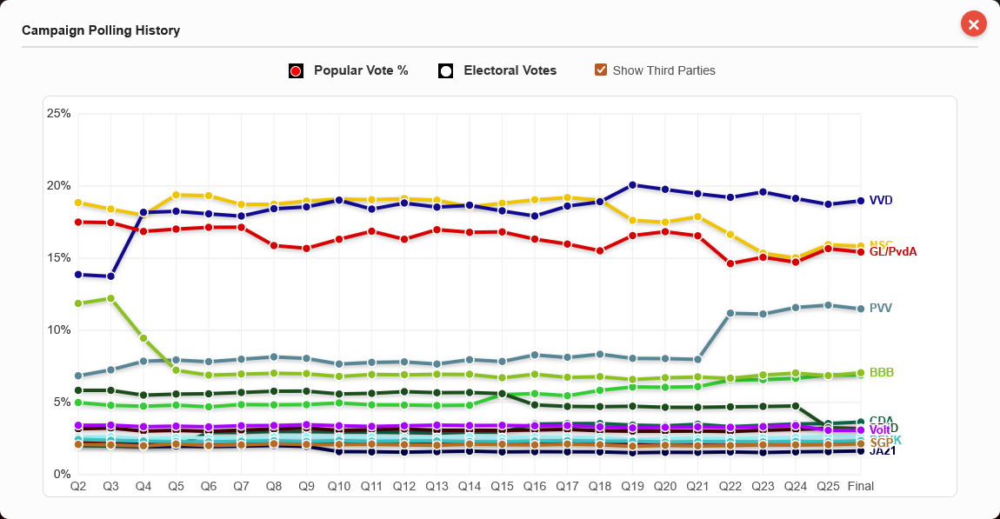

### Question counter
The [question counter](./codes/question_counter.js) is a tool for customizing the question counter text in the progress bar header. Inside it, you can define a mapping of question PKs to custom route names, or rather, the text that should be displayed for each question. For example:
```javascript
const routeNames = {
  1200: "Pocket Dimension Route",
  1201: "Electric Boogaloo Route",
  1202: "example",
};
```

means that the question counter will display "Pocket Dimension Route" for question PK 1200, "Electric Boogaloo Route" for question PK 1201, and "example" for question PK 1202.

### Question swapper
The [question swapper](./codes/question_swapper.js) is a tool for swapping the order of questions in a mod. It includes a single function, `questionSwapper()`, which takes two question numbers as arguments and swaps their order. For example:
```javascript
// swap question PKs 100 and 150
questionSwapper(100, 150);

// if player is on question 5 + answered the answer with PK 2500, then
// swap question PKs 100 and 150
if (e.question_number === 4 && ans === 2500) {
    questionSwapper(100, 150);
}
```

### Temporary song easter egg
In *All The Way*, clicking candidate/running mate images a total of six (6) times unlocks a new song in the music player. This is the [temporary song easter egg](./codes/song_easteregg.js) feature; here, we have a cleaned up version that lets it work in the players shown here. To customize it, you need to replace the image link that will trigger the songs, and also the song data you want, as shown here:
```javascript
  "https://i.imgur.com/kyGgGv1.gif": new Song(
    "68 Nixon",
    "The Chad Mitchell Trio",
    "https://i.imgur.com/qCeXoEF.png",
    "https://audio.jukehost.co.uk/GbUjVZl2OLsFKuDCDtXqtRYyx1SVm3Sy"
  ),
``` 

See example:
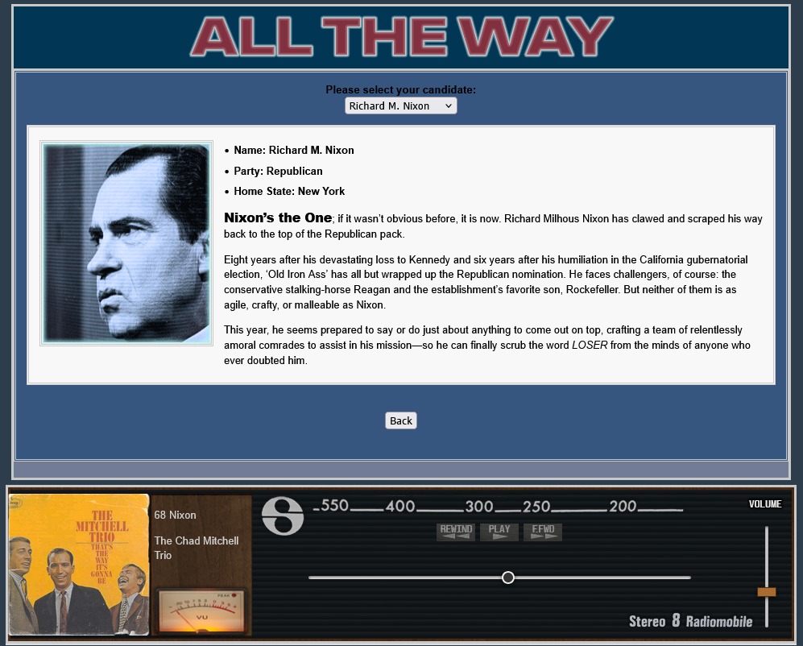

### Volatility feature
The [volatility applier](./codes/volatility_applier.js) snippet, as seen in *1992: Moonbeam*, applies volatility to global multipliers in the answer score global JSON. In other words, it randomly adjusts the values of global multipliers to introduce volatility into the scoring process, increasing the unpredictability of your answers.

For an individual answer, you can set a manual volatility value by creating a `volatility_range` property in your desired answer score. For example:

```json
{
        "model": "campaign_trail.answer_score_global",
        "pk": 15000,
        "fields": {
            "answer": 2000,
            "candidate": 78,
            "affected_candidate": 77,
            "global_multiplier": 0.005,
            "volatility_range": [0.0005, 0.0009]
        }
    },
```
This will set a volatility range of 0.0005 to 0.0009 for that answer, meaning the global multipliers will be randomly adjusted within that range. If no volatility range is set for an answer, it will generate max and min volatility values based on the global multiplier value.

### 3D map effect
*Very experimental*, but [this snippet](./codes/three_dee_effect.js) adds a 3D effect to the election night map view by applying a CSS transform to the map container.

----

## Music players
If the credits/attribution for the music players here is inaccurate, please contact me so I can update it. All credit goes to the original creators of the players, so please preserve the annotations in the source code so that everyone is properly credited. Note that, for some lesser used players, you may still have to ask the original creators for permission to use/modify the players.

### A Lifetime of This player
The YouTube-powered music player shown in the mod *2016: A Lifetime of This*, built on top of the *W.* player code. See source [here](./players/alot_player.js).
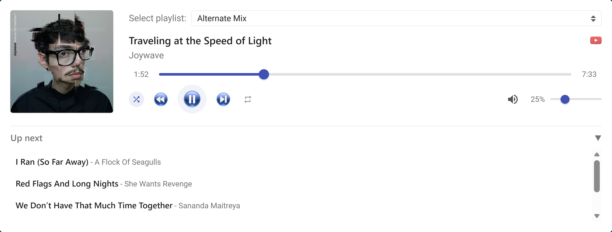

### All The Way player
The radio-themed player shown in the mod *1968: All The Way*. Shown here is a modified version of the player with some optimizations/cleanups and a more readable progress/volume bar. See source [here](./players/atw_player.js).
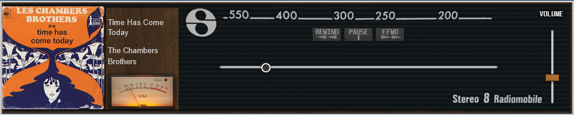

### American Carnage/Infinite Carnage player
The Spotify-themed music player shown in the mod *American Carnage*. Shown here is a modified version that was initially made for *2028: An Old Cycle*, with fixed icons, but went unused. See source [here](./players/ac_player.js).
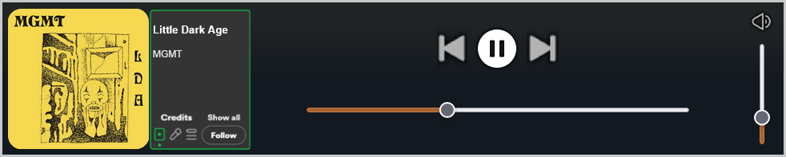

The version of the player shown in the American Carnage expansion *Infinite Carnage* can be seen below. See source [here](./players/ic_player.js).
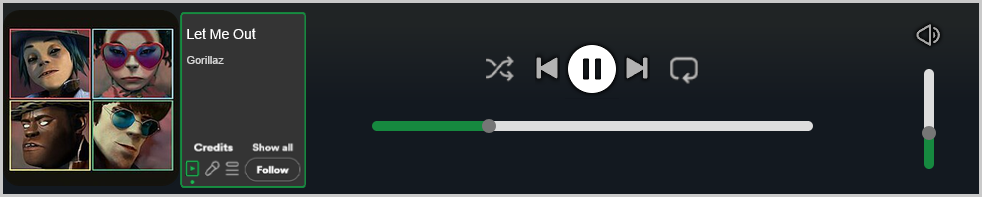

### An Old Cycle player
Also a Spotify-themed music player, this was made for *2028: An Old Cycle*. See source [here](./players/aoc_player.js).
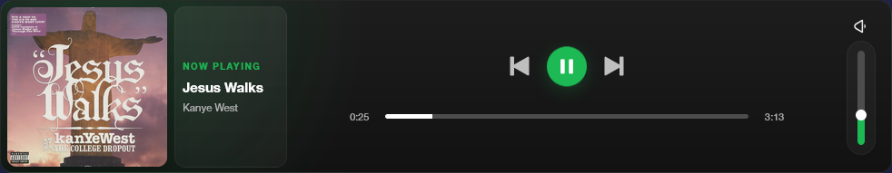

### Biden '08 player
A Windows Media Player-themed music player, shown in the mod *Biden '08*. Shown here is a modified version of the player with its Windows 7 volume bar theme included, and also the ability to click on the progress bar to seek. See source [here](./players/biden_player.js).
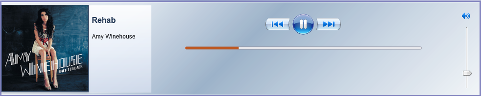

### Contract With America player
A music player with a design inspired by the 1990s-era music players, shown in the mod *1996: Contract With America*. Shown here is a somewhat more standardized version of the player. See source [here](./players/cwa_player.js).
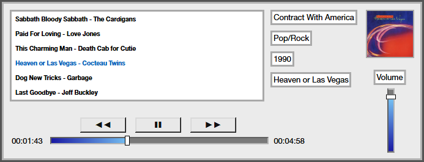

### Duke player
The late 80s/early 90s-era music player, shown in the mod *Duke*. Fun fact: it's actually a modified version of the music player used in the *Y. of Korea* mod. See source [here](./players/duke_player.js).


### Icarus player
Another Windows Media Player-themed music player, this music player was made for *2008: Icarus*. Shown here is a somewhat more standardized version of the player with fixed icons. See source [here](./players/icarus_player.js).
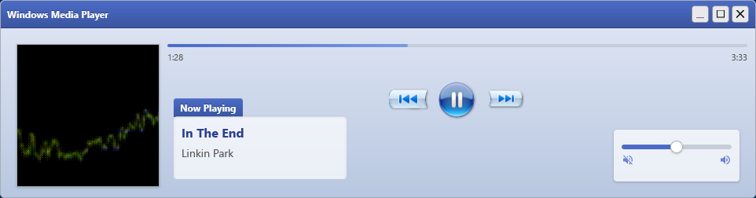

### Little Big Man player
The YouTube-powered music player shown in the mod *2012: Little Big Man*, which was built on top of the *A Lifetime of This* player code. See source [here](./players/lbm_player.js).


### More Than Ever/Good For Me player
The tape recorder-like music player shown in *1972: More Than Ever*, and also in *1976: Year Zero*. Shown here is a modified version of the player with some optimizations. See source [here](./players/mte_player.js).
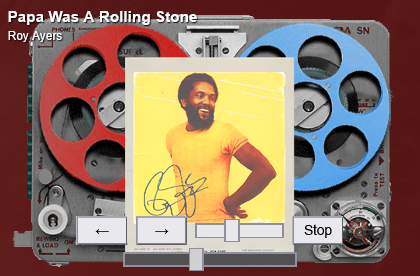

The *Good For Me* player, a slightly modified version of the More Than Ever player, is also shown here. See source [here](./players/gfm_player.js).
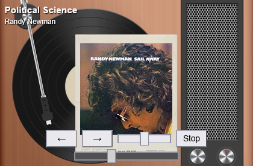

### No More Maga player
This is a modified version of the music player used in the mod *2024: No More Maga*. Shown here is a modified version of the player with a lower initial volume and other minor optimizations. See source [here](./players/nmmaga_player.js).
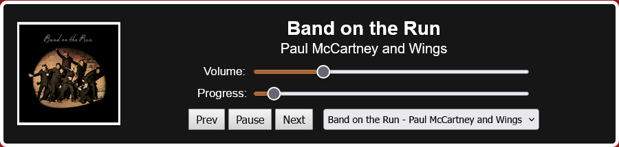

Alternatively, here is a Spotify-themed version of the player for that same mod. See source [here](./players/nmmaga_alt_player.js).
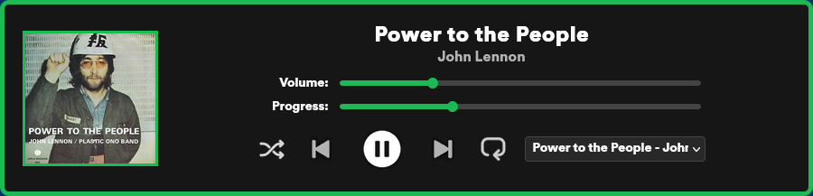

### Obamanation player
The Windows Media Center-themed player seen in the Deluxe edition of *2012: Obamanation*. See source [here](./players/obn_player.js).
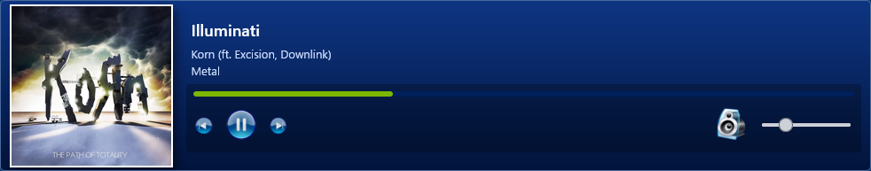

Similarly, the Windows Media Player-themed player from the original release can be seen [here](./players/obn).
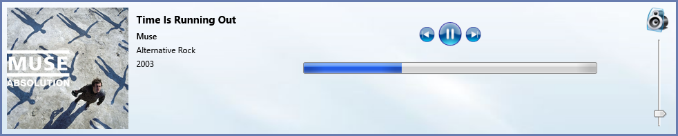

### Project 2024 player
Not the real player, but a loosely faithful recreation of the music player shown in the first couple of *Project 2024* sneak peeks, built on top of the *American Carnage* player. See source [here](./players/p24_player.js).
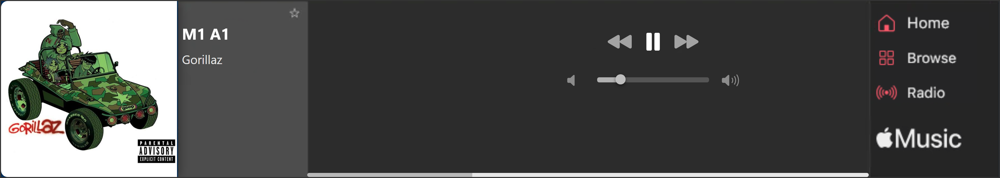

An alternative version of the music player from February 2026 sneak peeks can be seen [here](./players/p24alt_player.js).
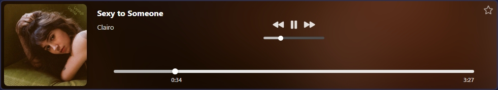

### ROC player
This is a modified version of the player used in *2000 ROC Redux* and other mods in the ROC series, with some optimizations and positioning fixes so it aligns with other players' layouts. See source [here](./players/roc_player.js).
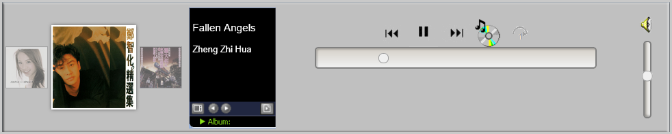

### Sundance player
The iPod-inspired music player for the *Sundance 2008* mod. Shown here is a modified version of the player with some standardizations and album art included. See source [here](./players/sundance_player.js).
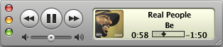

### The Apple Trail player
This simpler player, used on *The Apple Trail*, is a modified version of the *2000N* player made by DecstarG.  See source [here](./players/tat_player.js).
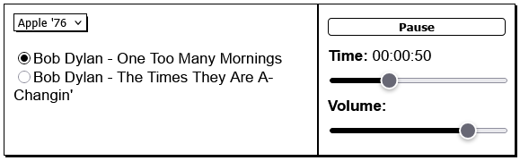

### TTNW player
The vinyl-esque music player shown in *Things That Never Were*. Shown here is a modified version of the player with the ability to switch playlists by clicking on the album art, and some optimizations. See source [here](./players/ttnw_player.js).
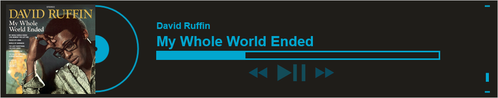

### W. player
The Windows Music Player-esque music player shown in the mods *W.* and *2004: Four More Wars*. Shown here is a modified version of the player with its Windows XP progress bar and volume control themes included, and also the ability to click on the progress bar to seek. See source [here](./players/w_player.js).
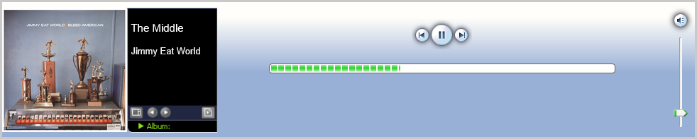

#### Other players
##### Apple/Macintosh players
This Apple-themed music player was reportedly made by Thatchmaster and used in *Vice*. See source [here](./players/apple_player.js).
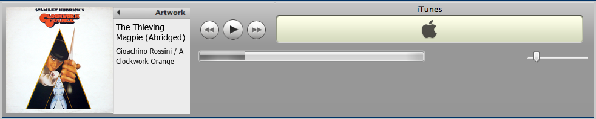

Another player, this time a Macintosh player, is a redesigned version based off a player made by HouseyHouse for a *1996: A New Age* mod mockup. See source [here](./players/mac_player.js).
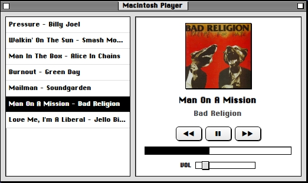

##### QuickTime player
Based off the QuickTime player, this was initially made for *2019 DOTP*, meant to be a remake of the *2019 North Korea* scenario. See source [here](./players/quicktime_player.js).
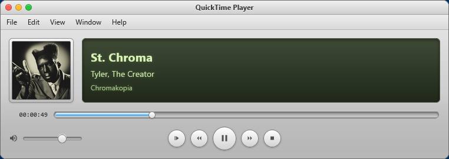

##### Quinto player
This was made for the unreleased Dan Quayle presidency simulator *Quaylee*, on top of the underlying code for the player used for *Moonbeam*. See source [here](./players/quinto_player.js).
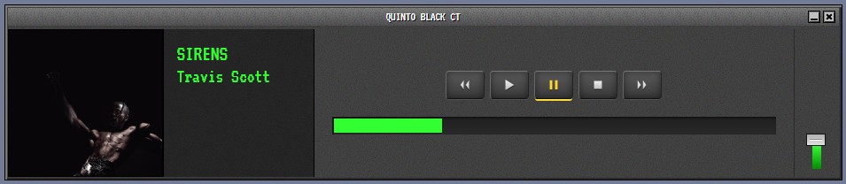

##### Razistorija player
With the design of an older radio player, this is a modified version of the music player used in *2012: Razistorija*. Playlist switching, if available, can be done by double-clicking on the song cover. See source [here](./players/razistorija_player.js).
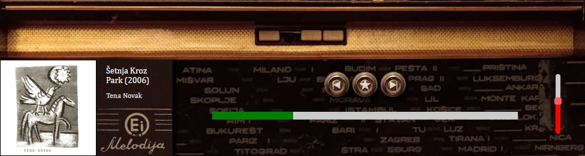

##### SoundCloud player
A SoundCloud-themed music player, this was one of the ideas briefly considered for *A Lifetime of This* before the YouTube-like music player was used instead. See source [here](./players/soundcloud_player.js).
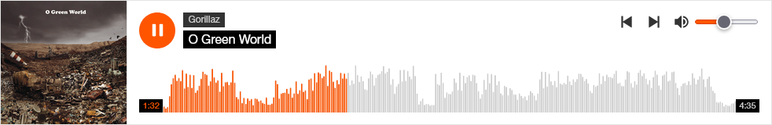

##### They'll Love Me When I'm Dead player
Similar to the *Things That Never Were* player (in fact, this was built on top of it!), this is a vaguely faithful recreation of the *They'll Love Me When I'm Dead* mod's music player, shown in its sneak peeks. See source [here](./players/tlmwid_player.js).
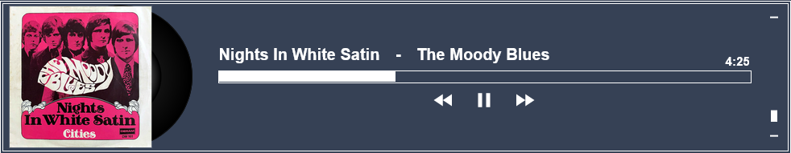

##### 90s players
Pretty much a generic music player with a slight 90s theme. Came from [this Reddit post](https://www.reddit.com/r/thecampaigntrail/comments/1tphs8t/comment/oob655a/) by No-Creme1061. See source [here](./players/noughties_player.js).
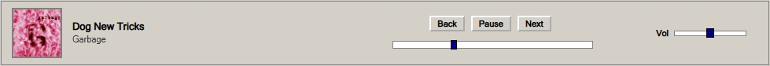

Another dark-themed 90s player, this is a redesigned version based off a player made by HouseyHouse for a *Perpetual American Terror* mod mockup, shared to us by C0SMO. See source [here](./players/noughtiesalt_player.js).
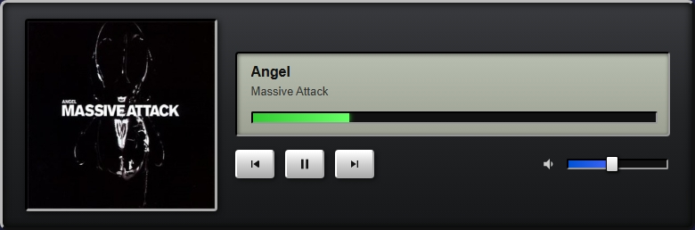

This other Windows Media Player-themed 90s player is a loose recreation of one shown in the unreleased mod *Red Dusk 2000: Quayle's America*. See source [here](./players/noughtiesalt2_player.js).
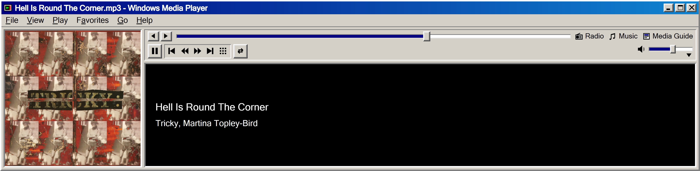

----

# Mod notes
Mods listed here are in various stages of development, and may be incomplete or buggy. Some may be intended for private use, but are being shared here for the sake of open-source-ness and preservation. Finally, a few others were canceled before they were finished, but are being shared here for the sake of "what could have been", or are here after being removed from the CTS mod gallery.

I do not own the content in these mods (unless otherwise specified), and am not responsible for any of it. All credit goes to the original creators. If you are the creator or responsible for any of the content in these mods and would like it removed, please contact me so I can take it down.

See [the mods folder](./mods) for the full list of mods.

## But A Man
This is a patched version of the mod *But A Man* with some extra fixes for the mod, primarily readability improvements to the question/tooltip text and some optimizations. Codes can be found [here](./mods/1972%20-%20But%20A%20Man_init.txt) (Code 1) and [here](./mods/1972%20-%20But%20A%20Man_HumphreyMuskie.txt) (Code 2). See example:
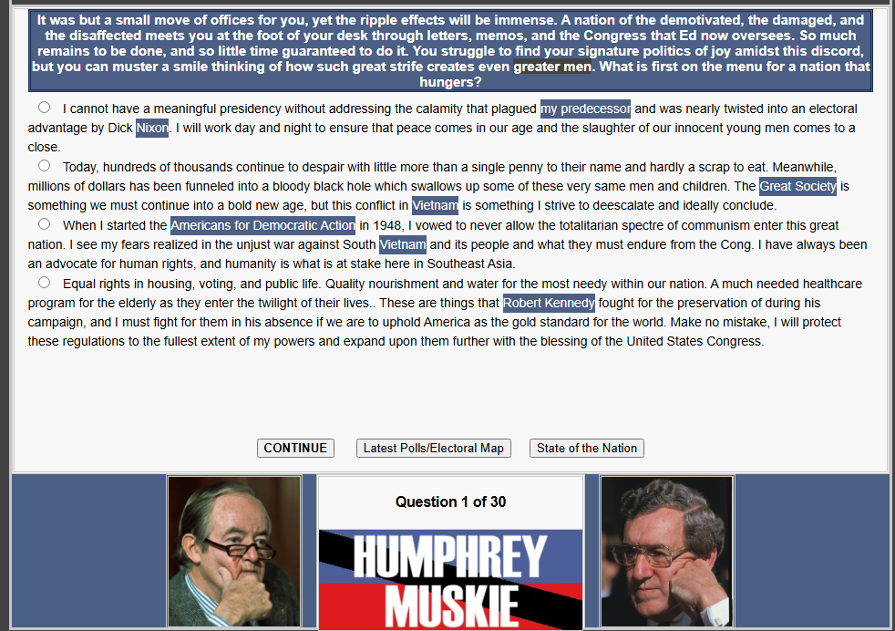

## Our Revolution
This is a patched version with a couple of extra fixes for the mod, primarily in the economic mechanics, but also including some bug fixes, several optimizations, other UI changes, a brand new soundtrack and a revamped Game Stats design. Codes can be found [here](./mods/2024%20-%20Our%20Revolution_init.txt) (Code 1) and [here](./mods/2024%20-%20Our%20Revolution_SandersHarris.txt) (Code 2). See example:
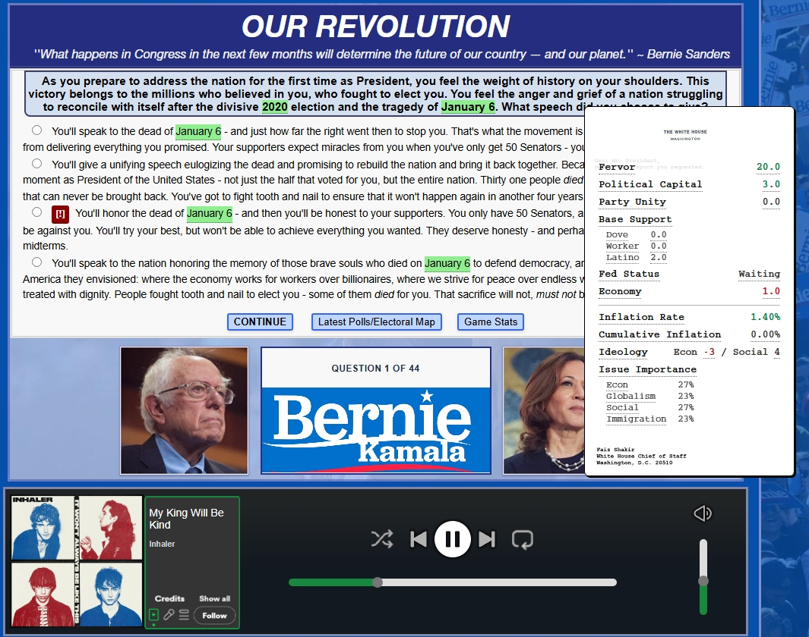

## TCT.net: the very best of
This is a compilation of the mods seen in [thecampaigntrail.net](https://thecampaigntrail.net), extracted and compressed so that you are able to play several of its scenarios at once! Included here are 1996, 1984, 1972, 1956, 1940, 1908, 1876, and 1800. Included as well is a brief patch that should let issue effects for other candidates work on either side.

As of now, the 2008, 2004, and 1964 mods are not not included due to their very minimal changes in comparison to their original counterparts (aside from images in the case of the first two). They may be added in the future if there are significant changes.

Code 1 can be found [here](./mods/TCTdotnet_code1.txt), and the Code 2 can be found [here](./mods/TCTdotnet_code2.min.txt). Note that because of the size of the code 2, the version above is minified to be around ~4mb. If you wish to inspect the code 2 for other mods, or want to try your hand at importing the uncompressed file, it can be found [here](./mods/TCTdotnet_code2.txt).

The alternative history scenarios on that same site (1968a and 1920a) can be found separately, with the Code 1 [here](./mods/TCTdotnet_althist_code1.txt) and the Code 2 [here](./mods/TCTdotnet_althist_code2.txt). (See minified versions [here](./mods/TCTdotnet_althist_code2.min.txt)).

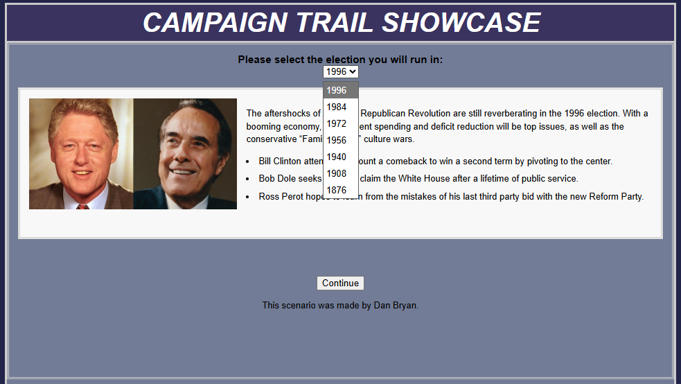

## Year Zero
This is a patched version of the mod *1976: Year Zero*, with some optimizations to the candidate loading screen + the music player, which will now fit on laptops and smaller screens. See code [here](./mods/1976%20-%20Year%20Zero_init.txt). See example:
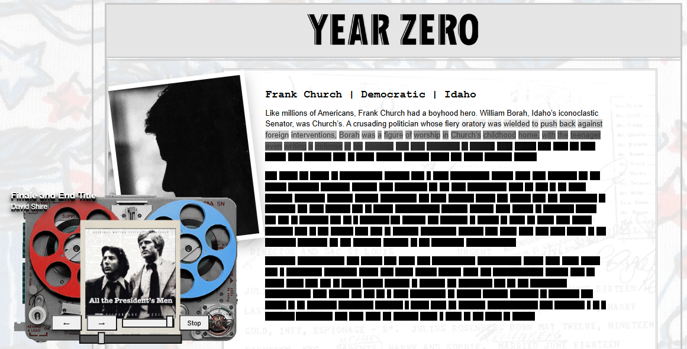

## Restored/recovered/non-loader mods
These mods were either restored by a user (or group of users), formally released but not on the mod loaders, or stored here in order to avoid deletion.
- **1844b**: on the NCT repository, but not on the actual mod loader. Basically an alternate history version where John Tyler decided to stick through with an independent campaign. Codes: [Code 1](.https://raw.githubusercontent.com/newcampaigntrail/newcampaigntrail.github.io/refs/heads/main/static/mods/1844b_init.html) | [Code 2](https://raw.githubusercontent.com/newcampaigntrail/newcampaigntrail.github.io/refs/heads/main/static/mods/1844b_PolkDallas.html)
- **1868: Reconvergence**: released on the subreddit, and reportedly made using AI. Only the Stevens/Sumner side is available. Codes: [Code 1](https://pastebin.com/raw/pRhdxngM) | [Code 2](https://pastebin.com/raw/CjJCuXeU)
- **1932 Irish Free State**: a general election mod for the 1932 Irish Free State election, restored by [u/Revan0001](https://www.reddit.com/user/Revan0001). Codes: [Code 1](./mods/others/1932%20Ireland_init.txt) | [Code 2](./mods/others/1932%20Ireland_FaíldeValera.txt)
- **1960 DtK**: per [the wiki](https://thewikitrail.miraheze.org/wiki/1960DTK), this mod takes place in an alternate timeline where a bomb kills both John F. Kennedy and Richard Nixon during a debate. Only the Johnson/Tawes side is playable; the other side is unplayable. This is a copy from [metheguy](https://github.com/metheguyTNCT), patched to fix a broken background and endings. Codes: [Code 1](./mods/others/1960DtK_init.txt) | [Code 2](./mods/others/1960DtK_JohnsonTawes.txt)
- **1964 NI**: on the NCT repository, but not on the actual mod loader.
  - [Code 1](https://raw.githubusercontent.com/newcampaigntrail/newcampaigntrail.github.io/refs/heads/main/static/mods/1964NI_init.html)
  - [Code 2 (Johnson/Jackson)](https://raw.githubusercontent.com/newcampaigntrail/newcampaigntrail.github.io/refs/heads/main/static/mods/1964NI_JohnsonJackson.html) | [Ending](https://raw.githubusercontent.com/newcampaigntrail/newcampaigntrail.github.io/refs/heads/main/static/mods/1964NI_JohnsonJackson_ending.html)
  - [Code 2 (Johnson/Muskie)](https://raw.githubusercontent.com/newcampaigntrail/newcampaigntrail.github.io/refs/heads/main/static/mods/1964NI_JohnsonMuskie.html) | [Ending](https://raw.githubusercontent.com/newcampaigntrail/newcampaigntrail.github.io/refs/heads/main/static/mods/1964NI_JohnsonMuskie_ending.html)
  - [Code 2 (Nixon/Goldwater)](https://raw.githubusercontent.com/newcampaigntrail/newcampaigntrail.github.io/refs/heads/main/static/mods/1964NI_NixonGoldwater.html) | [Ending](https://raw.githubusercontent.com/newcampaigntrail/newcampaigntrail.github.io/refs/heads/main/static/mods/1964NI_NixonGoldwater_ending.html)
  - [Code 2 (Nixon/Lodge)](https://raw.githubusercontent.com/newcampaigntrail/newcampaigntrail.github.io/refs/heads/main/static/mods/1964NI_NixonLodge.html) | [Ending](https://raw.githubusercontent.com/newcampaigntrail/newcampaigntrail.github.io/refs/heads/main/static/mods/1964NI_NixonLodge_ending.html)
- **1972 Democrats: If Not Now, Whem?**: released on August 1, 2026, not yet on any of the loaders but is here for easier viewing of the codes. Codes: [Code 1 (CTS)](https://raw.githubusercontent.com/yupperdoo/If-Not-Now-When/refs/heads/main/1972R-Init%20(CTS)) | [Code 2 (CTS)](https://raw.githubusercontent.com/yupperdoo/If-Not-Now-When/refs/heads/main/1972R-Democrats%20(CTS)) | [Code 1 (NCT)](https://raw.githubusercontent.com/yupperdoo/If-Not-Now-When/refs/heads/main/1972R-Init) | [Code 2 (NCT)](https://raw.githubusercontent.com/yupperdoo/If-Not-Now-When/refs/heads/main/1972R-Democrats)
- **1995 Iraq**: similar to **2019 North Korea**, this mod as restored by [u/Revan0001](https://www.reddit.com/user/Revan0001). Codes: [Code 1](./mods/others/1995%20-%20Iraq_init.txt) | [Code 2](./mods/others/1995%20-%20Iraq_HusseinIDB.txt)
- **1996 Israel**: hasn't been approved to the NCT mod loader, nor has been thoroughly vetted. Codes: [Code 1](https://raw.githubusercontent.com/Spinoza-arch/newcampaigntrail.github.io/dc9389cd95ae266a5fc669c861e6a94eea1b5dba/static/mods/1996_Israel_init.html) | [Code 2 (Rabin)](https://raw.githubusercontent.com/Spinoza-arch/newcampaigntrail.github.io/dc9389cd95ae266a5fc669c861e6a94eea1b5dba/static/mods/1996_Israel_RabinLabor.html) | [Code 2 (Netanyahu)](https://raw.githubusercontent.com/Spinoza-arch/newcampaigntrail.github.io/dc9389cd95ae266a5fc669c861e6a94eea1b5dba/static/mods/1996_Israel_NetanyahuLikud.html) 
- **1860 Alternate VPs**: hidden in the CTS mod loader, but available to play [here](https://campaigntrailshowcase.com/campaign-trail/?modName=1860).
- **1988b**: the original viviankesandre mod, which later got a spiritual successor, [The Rainbow Trail](https://campaigntrailshowcase.com/campaign-trail/?modName=1988RB). Hidden in the CTS mod loader, but available to play [here](https://campaigntrailshowcase.com/campaign-trail/?modName=1988b).
- **1992Redux**: Martha's redux of the 1992 mod. Hidden in the CTS mod loader, but available to play [here](https://campaigntrailshowcase.com/campaign-trail/?modName=1992Redux).
- **The Animal Trail**: hidden in the CTS mod loader, but available to play [here](https://campaigntrailshowcase.com/campaign-trail/?modName=2024NAT).

## Unreleased mods
These mods were unreleased for various reasons, but are still available here for preservation. Some of them may be incomplete or buggy, and may not work properly. If you are the creator or responsible for any of the content in these mods and would like it removed, please contact me so I can take it down.
- **1804: Assassin's Creed**: made by mefoo, never added to the loaders as the pull request to add it was closed. Codes: [Code 1](./mods/others/1804%20-%20Assassin's%20Creed_init.txt) | [Code 2](./mods/others/1804%20-%20Assassin's%20Creed_KenwayPinckney.txt)
- **DeanDemocracy '68**: a mod where James Dean, alive and well, runs for president in 1968. He faces off against the real-life candidates of that year, as well as a few other ones. Available running mates for Dean include Montgomery Clift, Robert Kennedy, Richard Daley, and Frank Sinatra. Running mates for Nixon are Spiro Agnew, Ronald Reagan, John Lindsay, and George Bush. Finally, George Wallace's running mates are Curtis LeMay, Ezra Taft Benson, and John Wayne. I might get back to this eventually now that I have the codes, but much of our progress on the question has been lost. Codes: [Code 1](./mods/others/1968%20-%20DeanDemocracy_init.txt) | [Code 2](./mods/others/1968%20-%20DeanDemocracy_DeanClift.txt)
- **1968 Midnight**: the third installation in the Midnight series and a sequel to [Midnight 1964](https://campaigntrailshowcase.com/campaign-trail/?modName=1964Midnight) and [Midnight 1965](https://www.newcampaigntrail.com/campaign-trail/?modName=Midnight%201965), this version was never fully complete, and the copies here are implied to have been released as part of a joke. The McGovern side is playable, however. Images and audio files were patched by Metheguy. Codes: [Code 1](./mods/others/1968Midnight_init.txt) | [Code 2](./mods/others/1968Midnight_McGovernWallace.txt)
- **1972 Viva Kennedy**: a short demo for the mod of same name, which ended up unreleased. Only the Reagan/Baker is available. Codes: [Code 1](./mods/others/1972Viva_init.txt) | [Code 2](./mods/others/1972Viva_ReaganBaker.txt)
- **2018 House**: made by Decstar, is heavily unfinished, and may have served as a proof of concept. Only Dem side is working, questions are the base 2016 Hillary questions, and the map is also unfinished. Codes: [Code 1](https://raw.githubusercontent.com/newcampaigntrail/newcampaigntrail.github.io/refs/heads/main/static/mods/2018house_init.html) | [Code 2](https://raw.githubusercontent.com/newcampaigntrail/newcampaigntrail.github.io/refs/heads/main/static/mods/2018house.html)
- **2024: Go Pat Go!**: what seems to be an early version of unreleased mod 2024: Go Pat Go!, circa October 2025. This version was erroneously uploaded to the NCT modmaker repo, and had to be restored to work here. Only Code 1 works, Code 2 is incomplete and broken. Very similar to *2024: Our Revolution*. Codes: [Code 1](./mods/others/2024%20-%20Go%20Pat%20Go!_init.txt)
- **2028: Soul of the Nation**: a Harris 2028 mod made by Mari. A Trump side was made but seemingly never released, though the Harris side is complete and available here. Minor CYOA patches have been included here, but the mod is otherwise the same as the last-available version. Codes: [Code 1](./mods/others/2028%20-%20Soul%20of%20the%20Nation_init.txt) | [Code 2](./mods/others/2028%20-%20Soul%20of%20the%20Nation_Harris_.txt)

## Withdrawn mods
These mods were released on either the subreddit [r/thecampaigntrail](https://www.reddit.com/r/thecampaigntrail), New Campaign Trail or Campaign Trail Showcase, but were later withdrawn for various reasons, either by the authors or by other circumstances. They are still available here for preservation.
- **2012: Razistorija**: based on Yugoslavian politics, this scenario features Milorad Dodik. The code here includes some performance improvements and fixes to an achievement, as the copy on the developers' side has since gone down. Codes: [Code 1](./mods/others/2012_-_Razistorija_init.txt) | [Code 2](./mods/others/2012_-_Razistorija_DodikMilanovic.txt)
- **2028: Smoke In The Air**: J.D. Vance vs. "an 18-year-old genderfluid Deltarune fan [that] somehow got the nomination and convinced some random dude they shitposted with 3 years ago to join the ticket." Codes: [Code 1](./mods/others/2028%20-%20Smoke%20In%20The%20Air_init.txt) | [Code 2](./mods/others/2028%20-%20Smoke%20In%20The%20Air_ExeonPerson.txt)
- **2028 Redux (The American Crossroads)**: also known as 2028 Redux. Made by gamerdoglover, this is a Gavin Newsom vs J.D. Vance mod. It was withdrawn fom the CTS mod loader for bug fixes, though it was not re-uploaded. This is a patched version that includes a fix to have the scenario map actually show up on the screen. Codes: [Code 1](./mods/others/2028Redux_init.txt) | [Code 2](./mods/others/2028Redux_NewsomWarnock.txt)

----

## Nina's CYOA guide
This is a guide for making CYOA questions, made by Nina. It includes tips and tricks for making good CYOA questions, as well as some common pitfalls to avoid. A copy of it is kept here for preservation as the original site it was hosted has since gone down. See [the guide here](./codes/cyoa/index.html).
